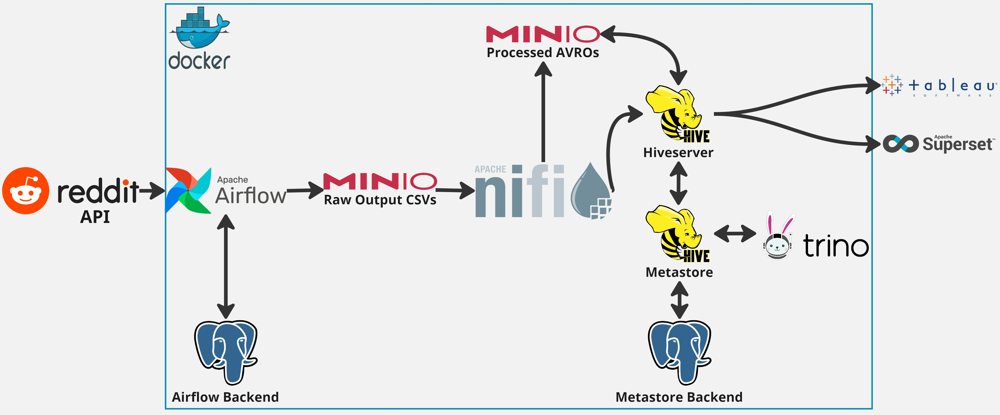

# RedditDataPipeline
Key components of this data pipeline are Reddit Api usage, Airflow, MinIO, NiFi, Hiveserver, Hive Metastore, PostgreSQL, Trino, and Tableau and Superset.

## Overview of the Pipeline

## Clone the project repository from github

`$ git clone https://github.com/akarce/RedditDataPipeline.git`

`$ cd RedditDataPipeline`

### First of all we set up Reddit as the data source by creating a Reddit app and obtaining the required credentials. 

1. Once you signed up and logged in to reddit, navigate to: https://www.reddit.com/prefs/apps
2. Scroll down to the “Developed Applications” section and click on the “Create App” or “Create Another App” button.
3. Complete the Form: You will see a form to complete with the following fields:
    - Name: Enter the name of your application.
    - App Type: Select “script” for personal or single-user bot use. For a web application or service, select “web app.”
    - Description: Optional; you can provide a short description of your application.
    - Permissions: Select “read” if you only need to retrieve data. Adjust based on your app’s needs.
    - Redirect URI: For a “script” app, you can use http://localhost:8080. For web apps, enter the appropriate redirect URI.

**Obtain Your Keys: After the app is created:**

- client_id: Located directly below the app name on the top-left corner of the app card (this is the shorter code).
- client_secret: Found under “secret” on the app card.

**Utilize the Keys: Use the client_id and client_secret in your config/config.conf file.**

**After finishing setup reddit, proceed to setup environment and run project containers:**

`$ ./airflow_env_and_run.sh`

This script will download several .jar files named hive-exec-4.0.0.jar and aws-java-sdk-bundle-1.12.367.jar needed properly run project, then set up environment variables and initialize the project for the first time. It configures necessary Airflow settings by creating a .env file with key environment variables such as the Airflow executor type, database connection details, logging levels, and credentials for the Airflow web UI. It then initializes the Airflow database, builds the Docker containers, and starts them in detached mode, ensuring the project environment is ready to run.

The orchestration is managed through Apache Airflow, while NiFi handles data transformation, including extracting CSV schemas and altering column data types. Metadata is stored in Hive Metastore, and MinIO serves as the file storage. The data is queried using Trino via JDBC drivers and is finally loaded into Hive tables for further analysis in Tableau.

**WebUI Links:**

`Airflow` : http://localhost:8082/

username: `admin` password: `admin`

`Minio` : http://localhost:9001/

username: `root` password: `root12345`

`Nifi` : https://localhost:9443/nifi

username: `<your_generated_username>` password: `<your_generated_password>`

`Superset:` http://localhost:8088/

username: `admin` password: `admin`

All the containers should be up and running, then we move to docker desktop and obtain our nifi generated username and generated password from container logs, with searching in logs for “generated user”.

a. Open Nifi WebUI link with following address : https://localhost:9443/nifi and make sure you login successfully with your credentials.

b. Drag and drop process group from top menu, and upload the nifi-workflow.json file.

c. Enable all services related to nifi-workflow from service management section.

d. Start all Processes from canvas.

**Make sure you login all the WebUIs successfully and ready to enable the etl_reddit_pipeline dag, then enable it**

**Go to MinIO WebUI and follow the bucket creation and csv file objects in raw folder path to appear.**

**Go to Nifi WebUI Canvas, you’ll see some dataflow started after airflow dag run finishes successfully.**

**Querying with Trino**

$ docker exec -it trino bash
[trino@86b69b8cef42 /]$ trino --catalog hive
trino> show schemas;

** Loading Data into Hive**

`$ docker exec -it hiveserver2 bash`

`/opt/hive$ beeline -u jdbc:hive2://hiveserver2:10000`

`jdbc:hive2://hiveserver2:10000> show databases;`

**Visualization Using Tableau and Superset:**

You can access to Tableau with installing desktop software and after installation, you need to copy the Hive JDBC driver and additional .jar files into “C:\Program Files\Tableau\Drivers” path to successfully visualize the data. You can find these jar files under tableau_drivers folder.

a. Copy the jar files in tableau-drivers to Tableau installations drivers folder (usually in “C:\Program Files\Tableau\Drivers” for windows)

b. Open Tableau Desktop and Connect to a Server > Other Databases (JDBC) and Sign In.

c. Tableau Hive Connection via JDBC driver; Username: hive Password: password dialect : SQL92 url : jdbc:hive2://localhost:10000/default

- Since Superset UI is web based, you need only to go “http://localhost:8088/” from your browser.